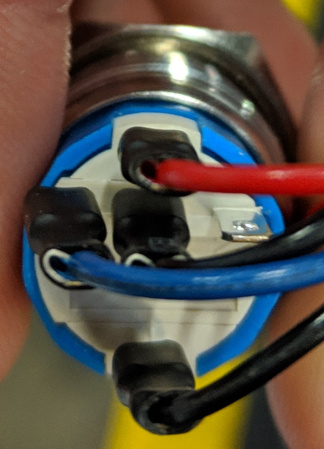

# Thelio Io

## Powerbutton

For the powerbutton connectors, the pinout is as follows:

```
LED+ Red
LED- Black
BTN+ Blue
BTN- Black
```

The powerbutton is connected in this manner:

```
      LED+
BTN+  BTN-  NONE

      LED-
```



## Io USB

The USB connector is connected with the shield to the right of the 4 USB pins.

For reference, this is the pinout:

```
5V   D-   D+   GND  NONE
```


## Io Powerbutton

The button is connected on the left side, and the motherboard on the right. Both are connected with the solid plastic side facing the edge.

This is the pinout:

```
Powerbutton             Motherboard
LED+  LED-  BTN+  BTN-  LED+ LED- BTN+ BTN-
```


## Motherboard Powerbutton

The motherboard powerbutton is connected on the part of the frontpanel header missing a pin. Due to a design oddity of the motherboards used for Thelio, the positive and negative powerbutton lines must be flipped.

This is the pinout:

```
LED-  LED+  BTN+  BTN-  NONE
```


